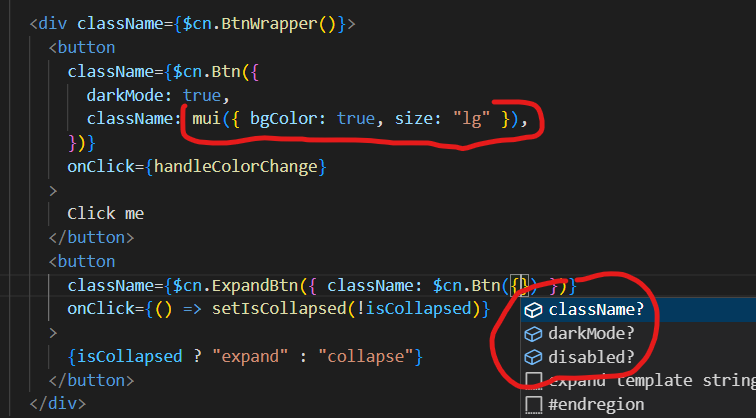

# Typed classnames loader

[](https://www.npmjs.com/package/typed-classnames)

> This webpack loader provides:
>
> - **type definition for css module classNames**
> - **fast classNames mapping**

# overview

if you define a css stylesheet like this

```scss
// style.module.scss

.typography {
  font-family: 'Times New Roman', Times, serif;

  &--sans-serif {
    font-family: Arial, Helvetica, sans-serif;
  }
  &--bold {
    font-weight: bold;
  }
  // _as_ is a special key to group a couple of classes in one variable defined by a union type of those classes.
  // like in the following example (size: sm | lg)
  &--sm_as_size {
    font-size: 15px;
  }
  &--lg_as_size {
    font-size: 24px;
  }
}

.item-wrapper {
  &--disabled {
    pointer-events: none;
  }
  &--centerd {
    display: flex;
    justify-content: center;
    align-items: center;
  }
}
```

you can use it like this

```tsx
// the style.typed.tsx file will be autogenerated after compiling your project

import { style, $cn } from './style.typed'

// style is the css module classnames, fully typed. no need to explain how to use it :=)
// $cn instead is a factory of mapped classnames utilities.

// main class
$cn.Typography() // => "typography"

// modifier values are passed as parameters
$cn.Typography({ bold: true, sansSerif: true }) // => "typography typography--bold typography--sans-serif"
$cn.Typography({ size: 'sm' }) // => "typography typography--sm_as_size"
$cn.Typography({ size: 'lg' }) // => "typography typography--lg_as_size"

// className parameter is a special key to concat external className
$cn.Typography({ bold: true, className: 'class1 class2' }) // => "typography typography--bold class1 class2"

// we can combine 2 or more typed classnames
$cn.ItemWrapper({ disabled: true, className: $cn.Typography({ size: 'sm' }) })
// => "item-wrapper item-wrapper--disabled typography typography--sm_as_size"
```

## how to Install

```bash
npm i -D typed-classnames
```

## configuration

see a Configuration example with nextjs

```ts
const nextConfig = {
  // ...
  webpack: (
    config,
    { buildId, dev, isServer, defaultLoaders, nextRuntime, webpack }
  ) => {
    const typedClassNamesRule = {
      test: /\.module\.scss$/,
      use: [
        {
          loader: 'typed-classnames',
          options: {
            /**
             * enabled: (required) the loader should be enabled only in Dev environment (not in prod)
             */
            enabled: !!dev && isServer,
            /**
             * exports: (required: { style: boolean, $cn: boolean } | Function).
             * at least one of the 2 parameters should be true
             * exports.style: false by default. set it to true in case you want to export ModuleStyle definitions.
             * exports.$cn: false by default. set it to true in case you want to export the mapped and typed classNames utility: $cn.
             
             *  you can use a function in case you want to set different values for given files/name templates
             * eg: (filename, fileDir) => /-eso\.module\.scss$/.test(filename) ? { style: true } : { $cn: true }
             * in this case, my-style-eso.module.scss for example will export only the ModuleStyle type
             **/
            exports: { style: false, $cn: true },
            // getOutputFileName: (optional), to generate file with different name then the default one.
            getOutputFileName: (filename, fileDir) =>
              `awesomename-${filename.replace(
                '.module.scss',
                '.autogenerated'
              )}`,
            // sassOptions: (optional) - sassOptions to pass to sass compiler
            // => sass.compileString(cssString, sassOptions). for example to resolve absolute imports, etc.
            sassOptions: {}
          }
        }
      ]
    }

    config.module.rules = config.module.rules ?? []
    config.module.rules.push(typedClassNamesRule)

    return config
  }
}
```

## classNamesMapping

for external libraries, we can use the **classNamesMapping** helper that allows us to map classNames getting a utility we will use in our components to enable only the desired classes.
let's see the following example

```ts
import { classNamesMapping } from 'typed-classnames/core'

// first we define the classnames utility in a configuration file: eg in classnames.config.ts
export const mui = classNamesMapping({
  // boolean values
  bgColor: 'mui--background',
  flex: 'mui--flex',
  // ternary values
  color: {
    primary: 'mui--color-primary',
    secondary: 'mui--color-secondary'
  },
  size: { lg: 'mui--font-size-28px', sm: 'mui--font-size-15px' }
})

// then, we import and use it in some components

mui({ bgColor: true }) // => 'mui--background'
// since flex is falsy, the result won't change
mui({ bgColor: true, flex: false }) // => 'mui--background'

mui({ bgColor: true, flex: true }) // => 'mui--background mui--flex'

// ternary values
mui({ color: 'primary' }) // => 'mui--color-primary'
mui({ color: 'secondary' }) // => 'mui--color-secondary'

// extra classnames added with "className" key
mui({ color: 'secondary', className: 'class1 class2' }) // => 'class1 class2 mui--color-secondary'
```



# License

MIT © [https://github.com/fernandoem88/typed-classnames](https://github.com/fernandoem88/typed-classnames)
